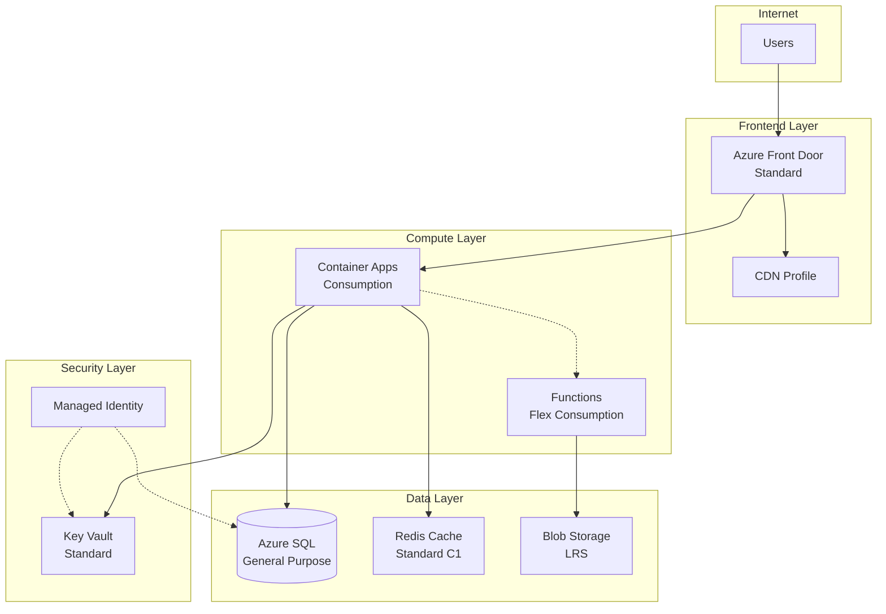

# Azure Architecture Design & Review

Microsoft Azure 아키텍처 설계 및 리뷰를 위한 스킬입니다. Well-Architected Framework(WAF) 5대 Pillar를 기반으로 아키텍처를 설계하고, 기존 아키텍처를 평가하여 개선 사항을 제시합니다.

## When to Use

- **신규 설계**: Azure 워크로드에 대한 아키텍처를 처음부터 설계할 때
- **아키텍처 리뷰**: 기존 Azure 아키텍처의 품질을 평가하고 개선점을 찾을 때
- **WAF 평가**: Well-Architected Framework 기준으로 체계적인 평가가 필요할 때
- **마이그레이션 설계**: On-premise 또는 다른 클라우드에서 Azure로 이전 시 타겟 아키텍처 설계
- **DR/HA 설계**: 재해 복구 및 고가용성 아키텍처 설계 및 검증

## Well-Architected Framework Pillars

| Pillar | 핵심 관심사 | 주요 평가 항목 |
|--------|------------|---------------|
| **Reliability** | 복원력, 가용성 | SLA, failover, backup, health monitoring |
| **Security** | 위협 방어, 데이터 보호 | Zero Trust, encryption, identity, network isolation |
| **Cost Optimization** | 비용 효율성 | Right-sizing, reserved instances, autoscaling |
| **Operational Excellence** | 운영 성숙도 | IaC, CI/CD, monitoring, incident response |
| **Performance Efficiency** | 성능 최적화 | Scaling, caching, latency, throughput |

## Workflow

### Mode A: Architecture Design (신규 설계)

#### Step 1: 요구사항 수집

사용자에게 다음 정보를 확인합니다:

1. **워크로드 유형**: Web App, API, Data Platform, IoT, AI/ML 등
2. **비기능 요구사항**:
   - 예상 트래픽 규모 (RPS, concurrent users)
   - 가용성 목표 (SLA: 99.9%, 99.95%, 99.99%)
   - RPO/RTO 요구사항
   - 데이터 주권/규제 요건 (GDPR, HIPAA 등)
3. **기술 제약사항**: 기존 기술 스택, 팀 역량, 예산 범위
4. **통합 요건**: 연동해야 할 기존 시스템이나 서비스

#### Step 2: 아키텍처 패턴 선택

요구사항에 따라 적절한 Azure 아키텍처 패턴을 선택합니다. [architecture-patterns.md](./references/architecture-patterns.md) 참조.

주요 패턴:
- **N-Tier**: 전통적 계층형 아키텍처
- **Microservices**: Container Apps / AKS 기반
- **Event-Driven**: Event Grid + Functions
- **CQRS + Event Sourcing**: 고성능 읽기/쓰기 분리
- **Serverless**: Functions + Logic Apps
- **Big Data / Analytics**: Synapse + Data Factory
- **Hub-Spoke Network**: 엔터프라이즈 네트워킹

#### Step 3: 서비스 선택 및 설계

각 아키텍처 계층에 대해 Azure 서비스를 선택합니다. [service-selection-guide.md](./references/service-selection-guide.md) 참조.

의사결정 시 고려사항:
- **Compute**: App Service vs Container Apps vs AKS vs Functions
- **Data**: SQL Database vs Cosmos DB vs PostgreSQL
- **Messaging**: Service Bus vs Event Hub vs Event Grid
- **Caching**: Redis Cache tier 선택
- **Storage**: Blob vs Files vs Queue vs Table
- **Networking**: VNet, Private Endpoint, Front Door, Application Gateway

#### Step 4: 아키텍처 다이어그램 생성

Mermaid 형식으로 아키텍처 다이어그램을 생성합니다.

**다이어그램 규칙:**
- `graph TB` 또는 `graph LR` 사용
- 논리적 계층별 `subgraph`로 그룹핑 (Frontend, Backend, Data, Security, Monitoring)
- 각 노드에 서비스명과 SKU/Tier 포함
- 연결선에 데이터 흐름 또는 프로토콜 표기
- `-->` 동기 호출, `-.->` 비동기/이벤트, `==>` 주요 데이터 경로

예시:


#### Step 5: 설계 문서 작성

다음 구조로 설계 문서를 작성합니다:

1. **개요**: 워크로드 설명, 목표
2. **아키텍처 다이어그램**: Mermaid 다이어그램
3. **서비스 인벤토리**: 선택된 서비스, SKU, 선택 근거 테이블
4. **네트워킹 설계**: VNet, subnet, NSG, Private Endpoint 구성
5. **보안 설계**: 인증/인가, 암호화, 네트워크 격리
6. **가용성/DR 설계**: SLA 계산, failover 전략
7. **비용 추정**: 월간 예상 비용 범위
8. **운영 설계**: 모니터링, 알림, 배포 전략

---

### Mode B: Architecture Review (기존 아키텍처 리뷰)

#### Step 1: 아키텍처 정보 수집

기존 아키텍처 정보를 수집합니다:

- **방법 1**: 사용자가 아키텍처 설명 또는 다이어그램을 제공
- **방법 2**: Azure Resource Graph를 통해 실제 리소스 조회
- **방법 3**: IaC 파일(Bicep/Terraform) 분석

Resource Graph 조회 시:
```
az graph query -q "Resources | where resourceGroup == '<rg-name>' | project name, type, location, sku, properties"
```

#### Step 2: WAF Pillar별 평가

[waf-review-checklist.md](./references/waf-review-checklist.md)를 기반으로 각 Pillar를 평가합니다.

**평가 등급:**
- 🟢 **Good**: 모범 사례를 잘 따르고 있음
- 🟡 **Needs Improvement**: 일부 개선 필요
- 🔴 **Critical**: 즉시 조치 필요한 문제

각 Pillar별로 다음을 산출합니다:
1. 현재 상태 요약
2. 발견된 문제점 (심각도 포함)
3. 개선 권고사항 (우선순위 포함)
4. 참고 Microsoft Learn 문서 링크

#### Step 3: 리뷰 보고서 생성

[review-report-template.md](./assets/review-report-template.md) 템플릿을 기반으로 보고서를 작성합니다:

```markdown
# Azure Architecture Review Report

## Executive Summary
- 전체 평가 등급
- 주요 발견사항 요약 (Top 5)
- 즉시 조치 필요 항목

## Architecture Overview
- 현재 아키텍처 다이어그램
- 서비스 인벤토리

## Pillar Assessment

### Reliability
- 평가: 🟡
- 발견사항 / 권고사항 테이블

### Security
...

### Cost Optimization
...

### Operational Excellence
...

### Performance Efficiency
...

## Prioritized Action Items
| # | 항목 | Pillar | 심각도 | 예상 효과 | 난이도 |
|---|------|--------|--------|----------|--------|

## References
- 관련 Microsoft Learn 문서 링크
```

#### Step 4: 개선 아키텍처 제안

Critical 또는 Needs Improvement 항목이 있을 경우, 개선된 아키텍처를 제안합니다:

1. 현재 vs 개선 아키텍처 비교 다이어그램
2. 변경 사항별 기대 효과
3. 마이그레이션 단계 (단계적 적용 가이드)

---

## Tools & Resources

### MCP Tools (사용 가능 시)

| Tool | 용도 |
|------|------|
| `mcp_azure_mcp_cloudarchitect` | 아키텍처 설계 가이드 |
| `mcp_azure_mcp_get_bestpractices` | Azure 모범 사례 조회 |
| `mcp_azure_mcp_documentation` | Azure 문서 검색 |
| `microsoft_docs_search` | Microsoft Learn 검색 |
| `microsoft_docs_fetch` | 문서 전문 조회 |
| `mcp_azure_mcp_bicepschema` | Bicep 스키마 조회 |

### CLI Commands

| Command | 용도 |
|---------|------|
| `az graph query` | Resource Graph 쿼리 |
| `az resource list` | 리소스 목록 조회 |
| `az monitor metrics list` | 메트릭 조회 |
| `az advisor recommendation list` | Advisor 권고사항 |

## Output Files

| Mode | 출력 파일 |
|------|----------|
| Design | `<workload-name>-architecture.md` |
| Review | `<workload-name>-review-report.md` |

사용자가 파일 저장을 요청한 경우에만 파일로 생성합니다. 기본적으로는 채팅 메시지로 결과를 제공합니다.

## Error Handling

| 상황 | 대응 |
|------|------|
| Azure 리소스 접근 불가 | 사용자 제공 정보 기반으로 리뷰 진행 |
| MCP 도구 미사용 가능 | CLI 또는 수동 분석으로 대체 |
| 불완전한 정보 | 가정사항을 명시하고, 사용자에게 확인 요청 |
| 규모가 큰 아키텍처 | 도메인/서비스별로 분할하여 단계적 리뷰 |
